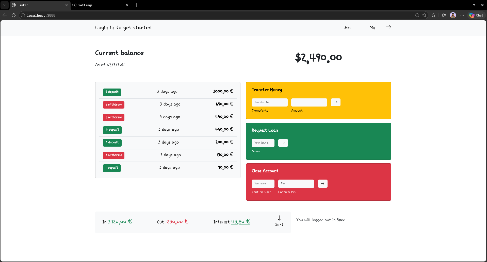

# eBanking 🏦

Una aplicación web de gestión bancaria moderna y minimalista que permite a los usuarios visualizar sus movimientos financieros, saldos y resúmenes de cuenta. Este proyecto forma parte de un curso avanzado de JavaScript.

## 📸 Vista Previa



## 🚀 Características

- **Visualización de Movimientos:** Lista detallada de depósitos y retiros.
- **Cálculo de Saldo:** Actualización automática del saldo total en tiempo real.
- **Resumen de Cuenta:** Cálculo y visualización de ingresos (incomes), egresos (outcomes) e intereses.
- **Conversión de Moneda:** Soporte para cálculos en diferentes divisas (EUR/USD).
- **Interfaz Responsiva:** Diseño limpio y adaptativo utilizando Bootstrap 5.

## 🛠️ Tecnologías Utilizadas

- **Lenguaje:** JavaScript (ES6+)
- **Motor de Plantillas:** [Pug](https://pugjs.org/)
- **Estilos:** [Bootstrap 5](https://getbootstrap.com/) y CSS3 personalizado.
- **Empaquetador (Bundler):** [Webpack 5](https://webpack.js.org/)
- **Linting & Formateo:** ESLint y Prettier.
- **Iconos:** Bootstrap Icons.

## 📦 Instalación y Configuración

Sigue estos pasos para configurar el proyecto localmente:

1. **Clona el repositorio:**

   ```bash
   git clone https://github.com/wjuma19dev2026-wq/ebanking.git
   cd ebanking
   ```

2. **Instala las dependencias:**
   ```bash
   npm install
   ```

## 💻 Uso

### Modo Desarrollo

Para ejecutar la aplicación con recarga en vivo (hot reload):

```bash
npm run dev
```

La aplicación estará disponible en `http://localhost:8080` (o el puerto que asigne Webpack).

### Construcción para Producción

Para generar los archivos optimizados en la carpeta `dist`:

```bash
npm run build
```

## 📁 Estructura del Proyecto

```text
src/
├── assets/
│   ├── css/        # Estilos personalizados
│   ├── fonts/      # Fuentes locales
│   ├── img/        # Imágenes del proyecto
│   └── js/         # Lógica de la aplicación (módulos ES6)
├── views/          # Componentes de la interfaz (Pug)
└── layout.pug      # Estructura base del HTML
```

## 📝 Notas del Desarrollador

El proyecto utiliza una arquitectura modular basada en módulos de JavaScript para separar la lógica de visualización (`display.js`), los datos de usuario (`user.js`) y las funciones auxiliares de cálculo (`helpers.js`).

---

Desarrollado con ❤️ para el curso de JavaScript en 2026.
